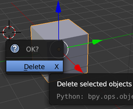

## Gegenstände hinzufügen

Schau Dir an, wie wir Gegenstände hinzufügen können. Wir werden den Würfel entfernen und ihn erneut hinzufügen.

+ Wähle den Würfel mit der linken Maustaste aus. Überprüfe den orangefarbenen Rand.

+ Drücke <kbd>X</kbd>. Du wirst gefragt, ob du den Gegenstand löschen willst.
    
    

+ Wähle **Delete** (Löschen) oder drücke <kbd>Enter</kbd>, um es zu löschen.

+ Um einen Würfel hinzuzufügen, gehe zum Dropdown-Menü **Hinzufügen** und klicke auf den Abschnitt **Mesh** und wähle dann **Cube**.

In der 3D-Ansicht wird ein Würfel angezeigt. Jetzt werden wir versuchen, einen Baum aus Würfeln zu erstellen.