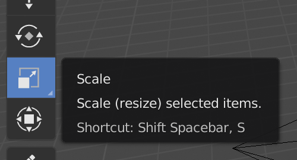
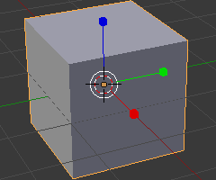

## Erstelle einen Baumstamm

Um einen Baumstamm zu erstellen, müssen wir die Größe des Würfels ändern. For this we'll be using the gizmo tools on the left side of your screen.

Using the move gizmo's handles you can move the cube along the x-axis, the y-axis, or the z-axis. Jeder Ziehpunkt hat einen Pfeil, der in Richtung seiner Achse zeigt.

Du kannst auch ändern, was diese Ziepunkte machen. For this you can use the other gizmo tools in the menu on the left of your screen.

Instead of arrows, we can have cubes at the end by selecting the scale gizmo from the menu. Die Würfel-Enden erlauben es dir, den Würfel in jede beliebige Form zu pressen und zu strecken!

+ Select the scale gizmo from the menu. Die Ziehpunkte sollten nun Würfelenden haben.

+ Drücke und strecke den Würfel so, dass er wie ein Baumstamm aussieht. Zum Beispiel:

+ Drehe die Ansicht, um festzustellen, ob der Baumstamm in Ordnung ist. Wenn nicht, drücke und strecke ihn etwas weiter.