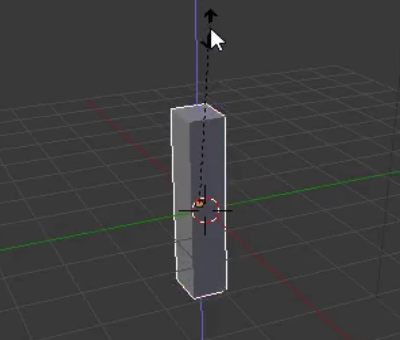

## Erstelle einen Baumstamm

Um einen Baumstamm zu erstellen, müssen wir die Größe des Würfels ändern. Dazu verwenden wir die Gizmo-Werkzeuge auf der linken Seite deines Bildschirms.

Mit Hilfe der Griffe des Bewegungs-Gizmo kannst du den Würfel entlang der x-Achse, der y-Achse oder der z-Achse bewegen. Jeder Ziehpunkt hat einen Pfeil, der in Richtung seiner Achse zeigt.

Du kannst auch ändern, was diese Ziepunkte machen. Dazu kannst du die anderen Gizmo-Werkzeuge im Menü auf der linken Seite deines Bildschirms verwenden.

Anstelle von Pfeilen können wir am Ende Würfel haben, indem wir das Würfelende aus dem Menü auswählen. Die Würfelenden erlauben es dir, den Würfel in jede beliebige Form zu pressen und zu strecken!

+ Wähle das Skalieren-Gizmo aus dem Menü. Die Ziehpunkte sollten nun Würfelenden haben.

+ Drücke und strecke den Würfel so, dass er wie ein Baumstamm aussieht. Zum Beispiel:

+ Drehe die Ansicht, um festzustellen, ob der Baumstamm in Ordnung ist. Wenn nicht, drücke und strecke ihn etwas weiter.