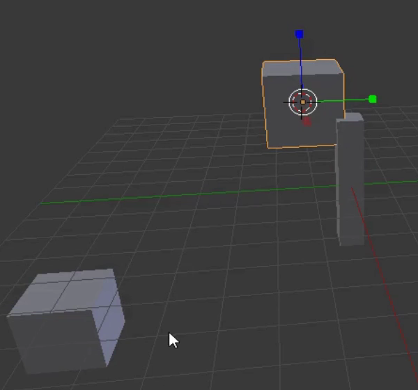

## Äste und Blätter hinzufügen

Lass uns einige Äste und Zweige hinzufügen. Dazu müssen wir einige weitere Würfel als unsere Blattzweige hinzufügen.

+ Zunächst wirst du feststellen, dass sich im Würfel ein kleiner Kreis befindet.

If you click on the same symbol from the menu on the left and then click somewhere in the 3D view, the circle will be placed at that location. Dies ist der 3D-Mauszeiger. Wenn du einen Gegenstand hinzufügst, wird der Gegenstand an der Position des 3D-Mauszeigers platziert.

+ Select this Cursor tool and make sure your mouse is somewhere inside the 3D view and left-click — close to the tree trunk might be handy. Beachte, dass sich der 3D-Mauszeiger an der Stelle befindet, auf die du geklickt hast.

+ Add a cube by selecting **Mesh** > **Cube** from the **Add** dropdown menu.

+ Klicke in der 3D-Ansicht auf eine andere Stelle (aber immer noch in der Nähe des Baumstamms) und füge einen weiteren Würfel hinzu. Zum Beispiel:

+ Erneut klicke in der 3D-Ansicht auf einen anderen Ort und füge einen weiteren Würfel hinzu.

Jetzt befinden sich drei Würfel in der 3D-Ansicht. Du kannst die blauen, grünen und roten Ziehpunkte erneut verwenden, um die Würfel an die Spitze des Baumstamms zu verschieben, damit er wie ein Baum aussieht.

+ From the menu below the 3D view, select the move gizmo so that you can move the cubes.

+ Bewege die Würfel in einer baumartigen Anordnung auf den Baumstamm. Zum Beispiel:

+ Drehe die 3D-Ansicht mit der mittleren Maustaste und überprüfe, ob der Baum aus allen Winkeln in Ordnung ist. Passe ihn gegebenenfalls an. Zum Beispiel:

Das Bild oben zeigt, dass die Würfel nicht richtig auf dem Baumstamm positioniert sind.