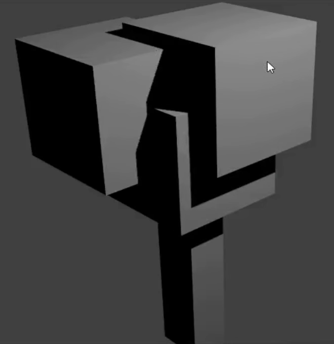

## Rendern

Um zu sehen, wie dein Baum aussieht, musst du ihn aus der Perspektive der Kamera sehen, indem du das Bild wiedergibst (renderst):

+ Drücke <kbd>F12</kbd> oder, wenn du auf einem Mac arbeitest, <kbd>FN + F12</kbd>.

Es könnte sein, dass man den Baum nicht richtig sieht, oder vielleicht sieht er nicht sehr baumähnlich aus in der Kameraansicht. Zum Beispiel:

+ Drücke <kbd>ESC</kbd>, um die Ansicht zu verlassen.

+ Wenn der Baum nicht sehr baumähnlich aussah, solltest du die Würfel vielleicht etwas neu anordnen.

+ Wenn dein Baum nicht in die Ansicht der Kamera passt, verschiebe die Kamera, so dass der Baum richtig durch die Kamera angezeigt wird.

+ Tippe <kbd>F12</kbd> erneut oder, wenn du auf einem Mac arbeitest, <kbd>FN + F12</kbd> um das gerenderte Bild zu sehen.

Du kannst auch mit der Lampe herumspielen, um die Beleuchtung deines Baumes zu verbessern.