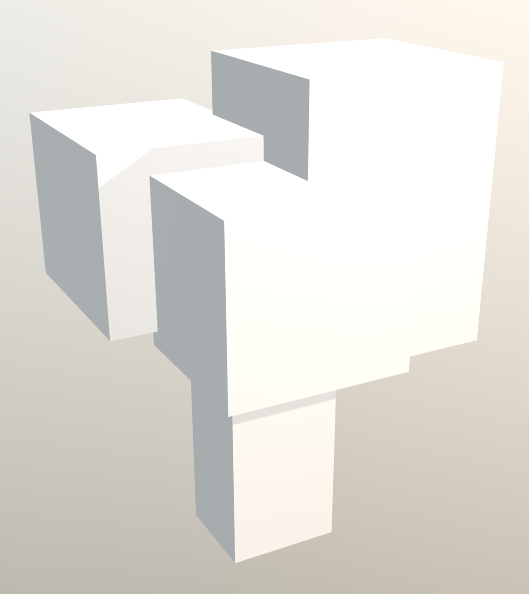

## What you will make

Create basic tree assets using only cubes!

--- print-only ---

--- /print-only ---

--- no-print --- 
Here is how your finished piece will look. Click it and drag it around to see it in 3D!

  <iframe class="responsive-embed__iframe" src="https://sketchfab.com/models/0e62596168f84ea0a40b4644c4ecc3f2/embed" frameborder="0" allowvr allowfullscreen mozallowfullscreen="true" webkitallowfullscreen="true"></iframe>

--- /no-print ---

### You will need

+ [Blender](https://www.blender.org/download/){:target="_blank"} (v4.3.2 or newer)
