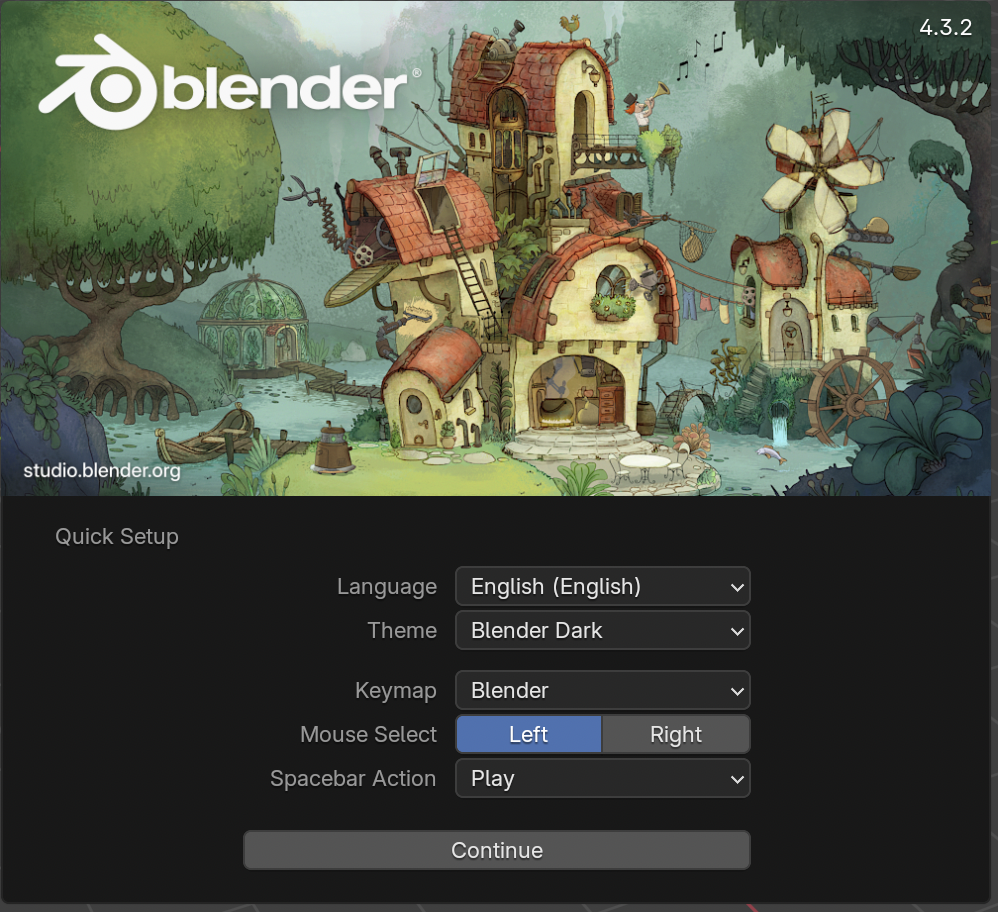

## Selecting objects

When you open Blender, you will see a splash screen. The splash screen of Blender 4.3.2 looks like this:

For this tutorial we won't be needing the splash screen.

+ Click to the right, and the Splash screen will disappear.

Now you'll see the 3D view. In the 3D view you have three objects: the lamp, the cube, and the camera.

You can select the objects by left-clicking on them. An orange border appears surrounding the selected object. In the image above, the cube is selected.

+ Left-click on the camera, the cube, or the lamp. If an object is correctly selected, there will be an orange border around it.
