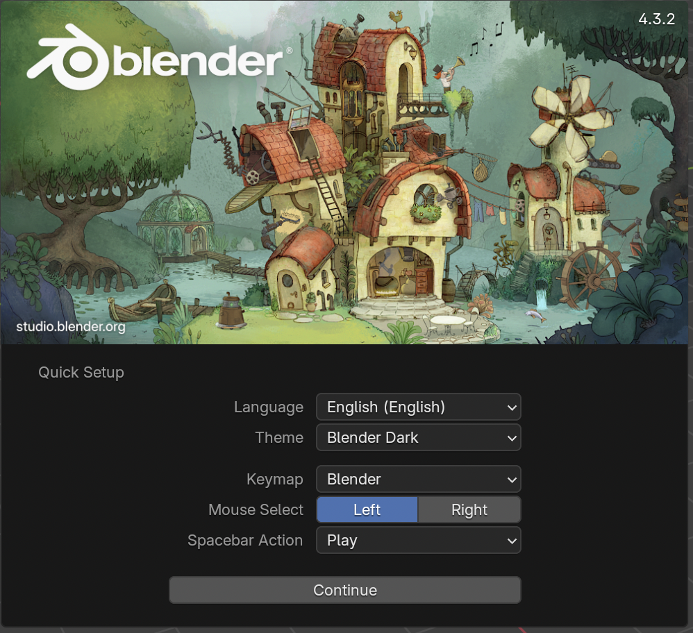

## Selecting objects

When you open Blender you will see a splash screen. The splash screen of Blender 2.76 looks like the figure below:

For this tutorial we won't be needing the Splash screen.

+ Click to the right and the Splash screen will disappear

Now you'll see the 3D view. In the 3D view you have 3 objects: the lamp, the cube and the camera.

You can select the objects by right clicking on them. An orange border appears surrounding the selected object. In the image above, the cube is selected.

+ Right click on the camera, the cube and the lamp. If an object is correctly selected, you should see an orange border surrounding the selected object.
