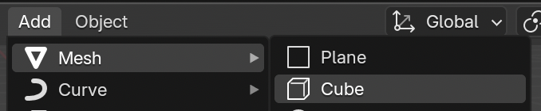

## Adding objects

Let's see how we can add objects. We'll remove the cube and add it again.

+ Select the cube with the left mouse button. Check for the orange border.

+ Press <kbd>X</kbd>. You'll be asked whether you want to delete the object.

    

+ Select **Delete** or press <kbd>Enter</kbd> to delete it.

+ To add a cube, go to the **Add** dropdown menu and click on the **Mesh** section, and then select **Cube**.

A cube will appear in the 3D view. Now we will try to create a tree out of cubes.
