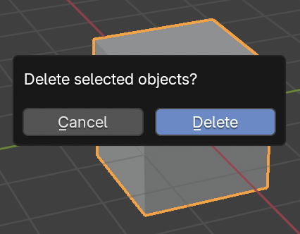
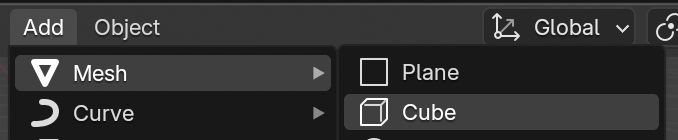

## Adding objects

Let's see how we can add objects. We'll remove the cube and add it again.

+ Select the cube with the right mouse button. Check for the orange border.

+ Press <kbd>X</kbd> to delete the cube.

+ You'll be asked whether you want to delete the object.

    

+ Select Delete? or press <kbd>ENTER</kbd>

The cube is deleted.

To add a cube:

+ Go to the toolbox on the left. On the left hand panel, the Toolbox, select the Create tab and then select Cube.

The cube appears again in the 3D view. Now we will try to create a tree from cubes.
