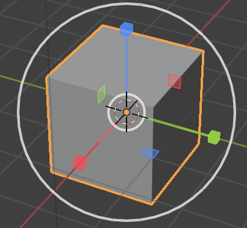
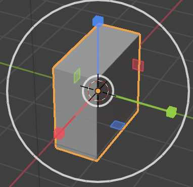
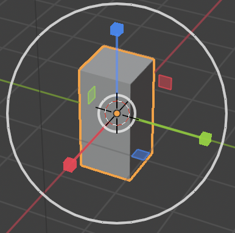
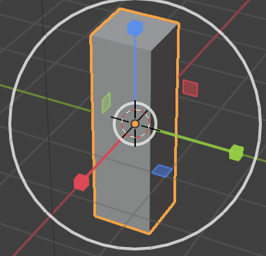

## Create a tree trunk

To create a tree trunk we need to resize the cube. For this we'll be using the blue, green and red handles.

The handles have an arrow which means that with these handles you can move the cube along the x-axis, the y-axis and the z-axis.

You can also change what these handles do. For this you can use the panel at the bottom of the 3D view.

Instead of arrows we can have cubes at the end by selecting the cube end from the menu.

+ Select the cube end from the menu. The handles should have cube ends.

This allows you to squeeze and stretch the cube into whatever shape you want it to be.

+ Squeeze and stretch the cube in a way that it starts to look like a tree trunk. For example:

+ Rotate around to see whether the tree trunk looks okay, and if not squeeze and stretch it a bit more.
