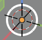
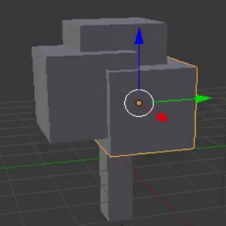

## Add branches and leaves

We'll be adding some branches and leaves. For this we need to add some more cubes. But first, notice there is a small circle in the cube.

If you click with the left mouse somewhere in the 3D view the circle will be placed at that location. This is the 3D cursor. It means that when you add an object, the object will be placed at the location of the 3D cursor.

+ Make sure your mouse is in the 3D view.

+ Click with the left mouse somewhere in the 3D view. A bit close to the tree trunk might be handy. Notice that the 3D cursor is at the postion where you clicked.

+ Add a cube, by selecting Create -> Cube from the Toolbox on the lefthand panel.

+ Click somewhere else in the 3D view but close to the tree trunk and add another cube. For example:

+ Again click somewhere else in the 3D view and add another cube.

So now we have three cubes in our 3D view. We can use the blue, green and red handles again to move the cubes on top of the tree trunk, to make it look a bit like a tree.

+ From the menu below the 3D view select the arrows at the end so that we can move the cubes.

+ Move the cubes on top of the tree trunk to make it look like a tree. For example:

+ Rotate the 3D view using the middle mouse and check if the tree looks okay from all angles. Adjust where necessary. For example:

The image above shows that the cubes are not positioned properly on the tree trunk. 
