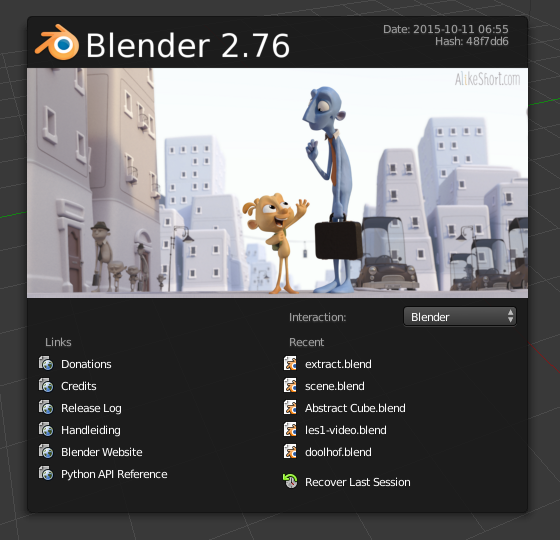

## Seleccionar objetos

Cuando abras Blender, verás una pantalla de inicio. La pantalla de inicio de Blender 2.81 se ve así:

Para este tutorial, no necesitaremos la pantalla de inicio.

+ Haz clic derecho y la pantalla de inicio desaparecerá.

Ahora verás la vista 3D. En la vista 3D hay tres objetos: la lámpara, el cubo y la cámara.

Puedes seleccionar los objetos haciendo clic izquierdo sobre ellos. Aparecerá un borde anaranjado alrededor del objeto seleccionado. En la imagen de arriba, el cubo está seleccionado.

+ Haz clic con el botón izquierdo en la cámara, el cubo o la lámpara. Si el objeto se seleccionó correctamente, aparecerá un borde anaranjado alrededor del mismo.