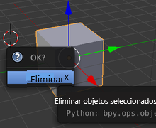
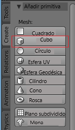

## Añadir objetos

Veamos cómo podemos añadir objetos. Eliminaremos el cubo y lo volveremos a añadir.

+ Selecciona el cubo con el botón izquierdo del mouse. Comprueba que aparece el borde anaranjado.

+ Presiona <kbd>X</kbd>. Te preguntará si deseas borrar el objeto.
    
    

+ Selecciona **Borrar** o presiona <kbd>Enter</kbd> para borrarlo.

+ Para añadir un cubo, ve al menú desplegable **Agregar** y haz clic en la sección **Malla**, y luego selecciona **Cubo**.

Aparecerá un cubo en la vista 3D. Ahora intentaremos crear un árbol utilizando cubos.