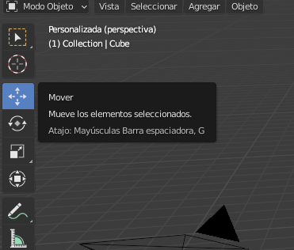
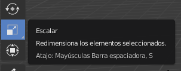

## Crear el tronco de un árbol

Para crear el tronco de un árbol, necesitamos modificar el tamaño del cubo. Para ello usaremos la barra de herramientas en el lado izquierdo de tu pantalla.

Usando las asas de la herramienta de movimiento se puede mover el cubo a lo largo del eje x, el eje y o el eje z. Cada asa tiene una flecha que apunta en la dirección de su eje.

También puedes cambiar la función de estos controles. Para esto, puedes usar las otras herramientas en el menú a la izquierda de tu pantalla.

En lugar de flechas, podemos tener cubos en los extremos seleccionando la herramienta escalar en el menú. ¡Los extremos del cubo te permiten apretar y estirar el cubo de la forma que quieras!

+ Selecciona la herramienta escalar en el menú. Las asas deben tener extremos en forma de cubo.

+ Aprieta y estira el cubo para que empiece a parecerse al tronco de un árbol. Por ejemplo:

+ Rota la vista para que puedas ver si el tronco del árbol se ve bien, si no, aprieta y estira un poco más.