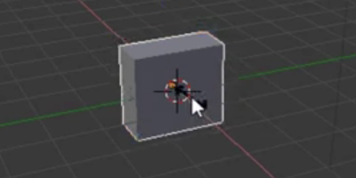

## Create a tree trunk

To create a tree trunk, we need to resize the cube. For this we'll be using the gizmo tools on the left side of your screen.

Using the move gizmo's handles you can move the cube along the x-axis, the y-axis, or the z-axis. Each handle has an arrow pointing into the direction of its axis.

You can also change what these handles do. For this you can use the other gizmo tools in the menu on the left of your screen.

Instead of arrows, we can have cubes at the end by selecting the scale gizmo from the menu. The cube ends allow you to squeeze and stretch the cube into whatever shape you want it to be!

+ Select the scale gizmo from the menu. The handles should then have cube ends.

+ Squeeze and stretch the cube so that it starts to look like a tree trunk. For example:

+ Rotate the view around to see whether the tree trunk looks okay, and if not, squeeze and stretch it a bit more.