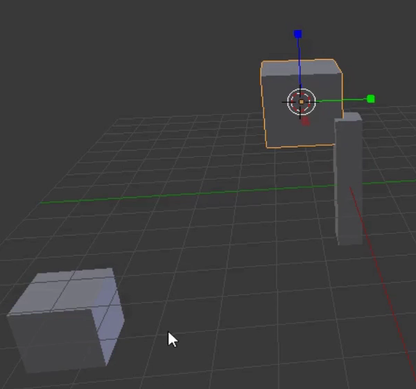
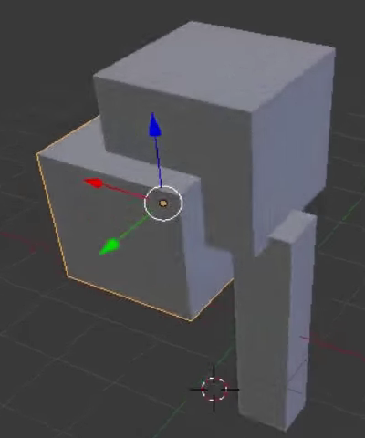

## Añadir ramas y hojas

Agregaremos algunas ramas y hojas. Para esto, necesitaremos añadir más cubos para nuestras ramas frondosas.

+ Primero, observa que hay un pequeño círculo en el cubo.

Si haces clic en el mismo símbolo del menú de la izquierda y luego haces clic en algún lugar de la vista 3D, el círculo se colocará en esa ubicación. Este es el cursor 3D. Cuando añadas un objeto, este se colocará en la ubicación del cursor 3D.

+ Selecciona la herramienta Cursor y asegúrate de que tu mouse se encuentra dentro de la vista 3D y haz clic izquierdo; sería mejor que sea cerca del tronco del árbol. Observa que el cursor 3D aparece en el lugar donde hiciste clic.

+ Añade un cubo seleccionando **Malla** > **Cubo** en el menu desplegable **Agregar**.

+ Haz clic en otro lugar de la vista 3D (no te alejes mucho del tronco del árbol) y añade otro cubo. Por ejemplo:

+ Una vez más, haz clic en algún otro lugar de la vista 3D y añade otro cubo.

Ahora hay tres cubos en la vista 3D. Puedes volver a utilizar los controles azul, verde y rojo para mover los cubos hacia la parte superior del tronco y que se parezca un árbol.

+ En el menú que aparece debajo de la vista 3D, selecciona la herramienta mover para que puedas mover los cubos.

+ Mueve los cubos hacia la parte superior del tronco y colócalos de manera que se vea como un árbol. Por ejemplo:

+ Rota la vista 3D utilizando el botón central del mouse y verifica que el árbol se vea bien desde todos los ángulos; haz modificaciones donde sea necesario. Por ejemplo:

La imagen de arriba muestra que los cubos no están ubicados correctamente en el tronco del árbol.