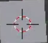
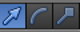

## Add branches and leaves

Let's add some branches and leaves. For this, we will need to add some more cubes as our leafy branches.

+ First, notice there is a small circle in the cube.

If you left-click somewhere in the 3D view, the circle will be placed at that location. This is the 3D cursor. When you add an object, the object will be placed at the location of the 3D cursor.

+ Make sure your mouse is somewhere inside the 3D view and left-click — close to the tree trunk might be handy. Notice that the 3D cursor is at the position where you clicked.

+ Add a cube by selecting **Create** > **Cube** from the **Toolbox** on the left-hand panel.

+ Click somewhere else in the 3D view (but still close to the tree trunk) and add another cube. Par exemple :

+ Once again, click somewhere else in the 3D view and add another cube.

Now there are three cubes in the 3D view. You can use the blue, green, and red handles again to move the cubes to the top of the tree trunk to make it look like a tree.

+ From the menu below the 3D view, select the arrow ends so that you can move the cubes.

+ Move the cubes on top of the tree trunk in a tree-like arrangement. Par exemple :

+ Rotate the 3D view using the middle mouse button and check that the tree looks okay from all angles, adjusting where necessary. Par exemple :

The image above shows that the cubes are not positioned properly on the tree trunk.