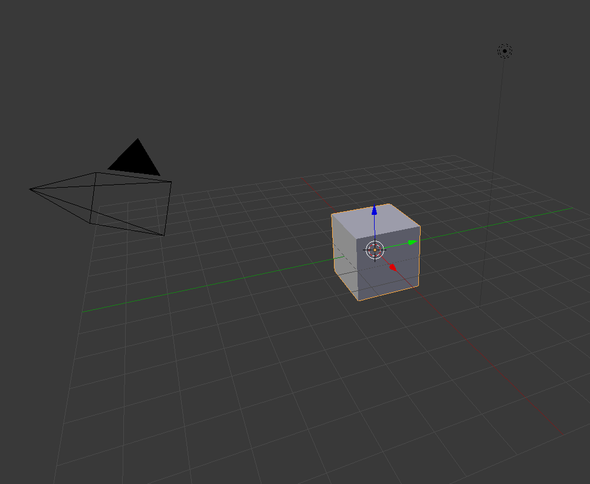

## वस्तुओं का चयन करना

जब आप ब्लेंडर खोलते हैं, तो आप एक स्प्लैश स्क्रीन देखेंगे। ब्लेंडर की स्प्लैश स्क्रीन 2.81 इस तरह दिखती है:

इस ट्यूटोरियल के लिए हमें स्प्लैश स्क्रीन की आवश्यकता नहीं होगी।

+ दाईं ओर क्लिक करें, और स्पलैश स्क्रीन गायब हो जाएगी।

अब आप 3D व्यू देखेंगे। 3D व्यू में आपके पास तीन वस्तुएँ हैं: लैंप, क्यूब, और कैमरा।

आप वस्तुओं पर राइट-क्लिक करके उनका चयन कर सकते हैं। चयनित वस्तु के आस-पास एक नारंगी बॉर्डर दिखाई देता है। उपर्युक्त छवि में, क्यूब का चयन किया गया है।

+ कैमरा, क्यूब, या लैंप पर पर बायाँ-क्लिक करें। यदि किसी वस्तु का चयन सही तरीके से किया गया है, तो उसके चारों ओर एक नारंगी बॉर्डर होगा।