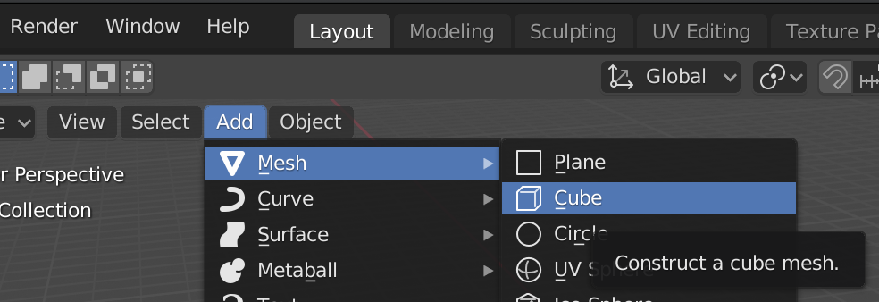

## वस्तुएँ जोड़ना

आइए देखते हैं कि हम वस्तुएँ किस तरह जोड़ सकते हैं। हम क्यूब को निकाल देंगे और उसे फिर से जोड़ेंगे।

+ दाएँ माउस बटन से क्यूब का चयन करें। देखें कि नारंगी बॉर्डर है।

+ <kbd>X</kbd> को दबाएँ। आपसे पूछा जाएगा कि क्या आप वस्तु को हटाना चाहते हैं।
    
    

+ इसे हटाने के लिए **Delete** का चयन करें या <kbd>Enter</kbd> दबाएँ।

+ कोई क्यूब जोड़ने के लिए, बाईं ओर **Toolbox** नाम के पैनल पर जाएँ, 0>Create</strong> टैब पर क्लिक करें, और फिर **Cube** का चयन करें।

3D व्यू में एक क्यूब दिखाई देगा। अब हम क्यूब्स से पेड़ बनाने की कोशिश करेंगे।