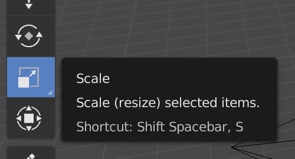
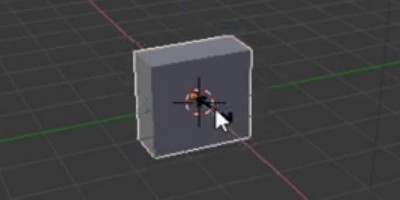

## पेड़ का तना बनाएँ

पेड़ का तना बनाने के लिए, हमें क्यूब का आकार बदलना होगा। इसके लिए हम आपके स्क्रीन के बायीं ओर के उपयोगी उपकरणों का उपयोग करेंगे।

इन हैंडलों का उपयोग करके आप क्यूब को x-अक्ष, y-अक्ष, या z-अक्ष पर ले जा सकते हैं । प्रत्येक हैंडल में एक तीर है जो उसकी धुरी की दिशा में इंगित करता है।

आप यह भी बदल सकते है कि ये हैंडल क्या करते हैं। इसके लिए आप अपनी स्क्रीन के बाईं ओर स्थित मेनू में अन्य सुविधाजनक टूल का उपयोग कर सकते हैं।

तीरों के बजाए, हम मेनू से क्यूब के सिरे का चयन करके अंत में क्यूब रख सकते हैं। क्यूब के सिरों से आप क्यूब को अपने मनचाहे तरीके से चाहे कितना भी छोटा या बड़ा कर सकते हैं!

+ मेनू से स्केल ऐक्टिव चुनें। हैंडलों में क्यूब के सिरे होने चाहिए।

+ क्यूब को निचोड़ें और फैलाएं ताकि वह पेड़ के तने की तरह दिखने लगे। उदाहरण के लिए:

+ यह देखने के लिए दृश्य को चारों ओर घुमाएँ कि क्या पेड़ का तना ठीक दिखता है या नहीं, और यदि नहीं, तो इसे थोड़ा और छोटा और बड़ा करें।