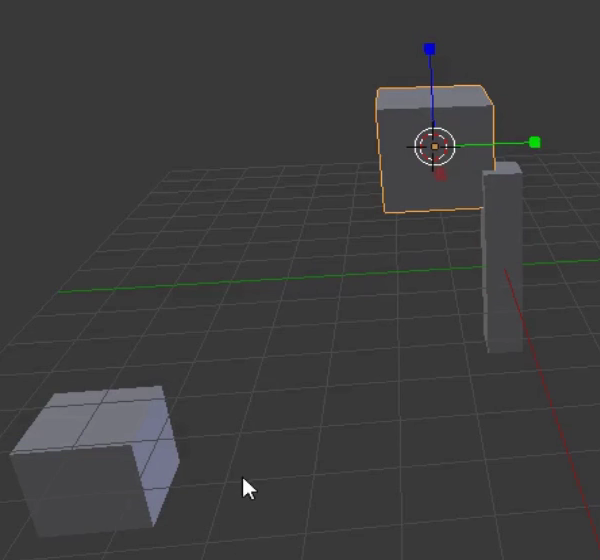

## शाखाएँ और पत्तियाँ जोड़ें

आइए कुछ शाखाएँ और पत्तियाँ जोड़ें। इसके लिए, हमें अपनी पत्तेदार शाखाओं के रूप में कुछ और क्यूब जोड़ने होंगे।

+ सबसे पहले, ध्यान दें कि क्यूब में एक छोटा घेरा है।

यदि आप 3D व्यू में कहीं भी बायाँ-क्लिक करते हैं, तो घेरा उस स्थान पर रखा जाएगा। यह 3D कर्सर है। जब आप कोई वस्तु जोड़ते हैं, तो वह वस्तु 3D कर्सर के स्थान पर रखी जाएगी।

+ सुनिश्चित करें कि आपका माउस कहीं भी 3D व्यू के अंदर है और बायाँ-क्लिक करें - इसे पेड़ के तने के नज़दीक रखने से आसानी हो सकती है। ध्यान दें कि 3D कर्सर उस स्थिति पर है जहाँ आपने क्लिक किया था।

+ बाईं ओर के पैनल पर **Toolbox** से **Create** > **Cube** का चयन करके क्यूब जोड़ें।

+ 3D व्यू में कहीं और क्लिक करें (लेकिन अभी भी पेड़ तने के नज़दीक) और एक और क्यूब जोड़ें। उदाहरण के लिए:

+ एक बार फिर, 3D व्यू में कहीं और क्लिक करें और एक और क्यूब जोड़ें।

अब 3D व्यू में तीन क्यूब हैं। क्यूब पेड़ के तने के शीर्ष पर ले जाने के लिए आप नीले, हरे और लाल हैंडल का फिर से उपयोग कर सकते हैं जिससे वह एक पेड़ जैसा दिखाई दे।

+ 3D व्यू के नीचे दिए गए मेनू से, तीर के सिरों का चयन करें ताकि आप क्यूब दूसरी जगह ले जा सकें।

+ पेड़ जैसी व्यवस्था में क्यूब को पेड़ के तने के शीर्ष पर ले जाएँ। उदाहरण के लिए:

+ माउस के बीच वाले बटन का उपयोग करके 3D व्यू को घुमाएँ और जाँच करें कि पेड़ सभी कोणों से ठीक दिखता है, जहाँ ज़रूरी हो वहाँ फेर-बदल करें। उदाहरण के लिए:

उपरोक्त छवि से पता चलता है कि पेड़ के तने पर क्यूब ठीक जगह पर नहीं रखे गए हैं।