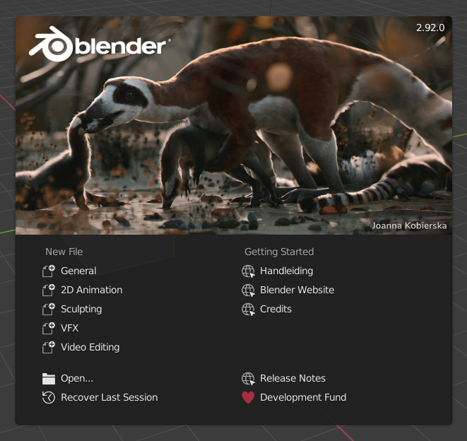

## Objecten selecteren

Als je Blender opent, zie je een startscherm. Het startscherm ziet er in Blender 2.92 zo uit:

Voor deze tutorial hebben we geen startscherm nodig.

+ Klik rechts van het scherm en het startscherm verdwijnt.

Nu zie je de 3D-weergave. In de 3D-weergave zie je drie objecten: de lamp, de kubus en de camera.

Je kunt de objecten selecteren door er met je linkermuisknop op te klikken. Er verschijnt een oranje rand om het geselecteerde object. In de afbeelding hierboven is de kubus geselecteerd.

+ Klik met links op de camera, de kubus of de lamp. Als een object correct geselecteerd is, zal er een oranje rand omheen zitten.