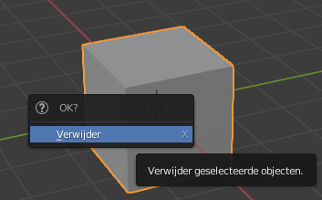
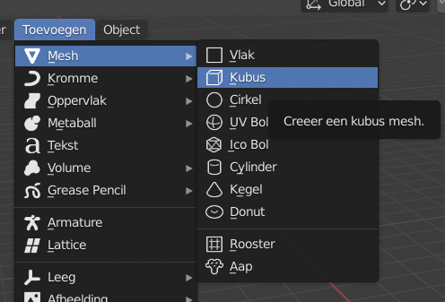

## Objecten toevoegen

Laten we kijken hoe we objecten kunnen toevoegen. We verwijderen de kubus en zullen deze weer toevoegen.

+ Selecteer de kubus met de linkermuisknop. Zorg ervoor dat je de oranje rand is.

+ Druk op <kbd>X</kbd>. Er wordt je gevraagd of je het object wilt verwijderen.
    
    

+ Klik op **Verwijder** of <kbd>Enter</kbd> om het te verwijderen.

+ Om een kubus toe te voegen, ga je naar het **Toevoegen** menu, klik op de **Mesh** sectie en selecteer **Kubus**.

Er verschijnt een kubus in de 3D-weergave. Nu gaan we proberen een boom van kubussen te maken.