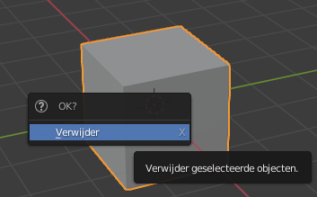
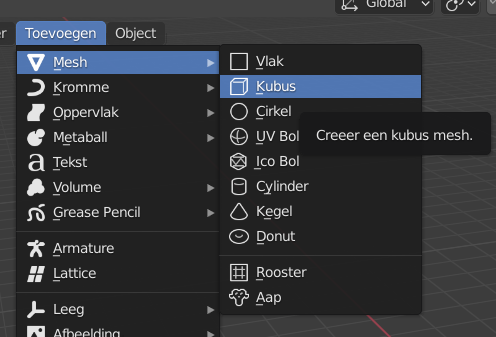

## Adding objects

Let's see how we can add objects. We'll remove the cube and add it again.

+ Selecteer de kubus met de rechter muisknop. Zorg ervoor dat je de oranje rand ziet.

+ Press <kbd>X</kbd>. You'll be asked whether you want to delete the object.
    
    

+ Select **Delete** or press <kbd>Enter</kbd> to delete it.

+ To add a cube, go to the left-hand panel, called the **Toolbox**, click on the **Create** tab, and then select **Cube**.

A cube will appear in the 3D view. Now we will try to create a tree out of cubes.