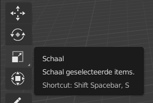
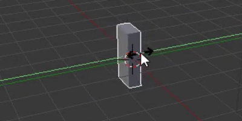

## Maak een boomstam

Om een boomstam te maken, moeten we de grootte van de kubus wijzigen. Hiervoor gebruiken we de gizmo gereedschappen aan de linkerkant van je scherm.

Met de move (verplaats) handvatten kun je de kubus langs de x-as, y-as of z-as bewegen. Elk handvat heeft een pijl die wijst in de richting van zijn as.

Je kunt ook veranderen wat de handvatten doen. Hiervoor kun je de andere gizmo gereedschappen in het menu aan de linkerkant van je scherm gebruiken.

In plaats van pijlen, kunnen we blokjes aan het eind hebben door de schaal gizmo van het menu te gebruiken. Door de blokjeseinden kun je de kubus in elke vorm krimpen en uitrekken die je wilt!

+ Selecteer de schaal gizmo van het menu. De handvatten zouden nu blokjeseinden moeten hebben.

+ Krim en rek de kubus uit zodat het er als een boomstam uit komt te zien. Bijvoorbeeld:

+ Roteer het beeld om te zien of de boomstam er goed uit ziet, zo niet, krimp en rek nog wat meer.