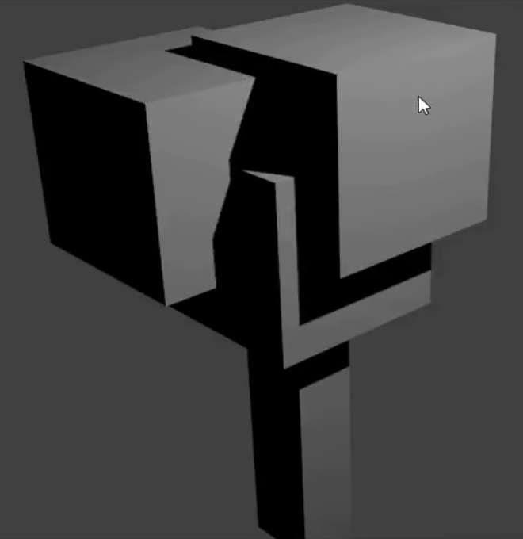

## Renderen

Om te zien hoe je boom eruit ziet, moet je het bekijken vanuit het perspectief van de camera door de afbeelding te renderen:

+ Druk op <kbd>F12</kbd> of, als je op een Mac werkt, <kbd>FN + F12</kbd>.

Het kan zijn dat je de boom niet goed ziet, of je boom ziet er niet erg boomachtig uit vanuit de cameraweergave. Bijvoorbeeld:

+ Klik op <kbd>ESC</kbd> om de weergave te verlaten.

+ Als de boom er niet erg boomachtig uitzag, kun je de kubussen nog wat verplaatsen.

+ Als je boom niet in de camera-weergave paste, beweeg de camera dan naar een plek waarvandaan je de boom wel goed kunt zien.

+ Druk weer op <kbd>F12</kbd> of, als je op een Mac werkt, op <kbd>FN + F12</kbd> om de gerendeerde afbeelding te zien.

Je kunt ook de lamp verplaatsen om de verlichting van je boom beter te zien.