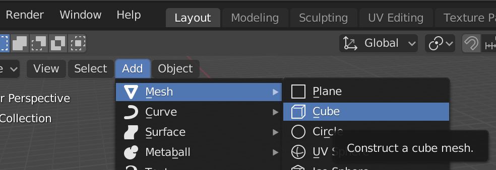

## Adăugarea obiectelor

Să vedem cum putem adăuga obiecte. Vom scoate cubul și îl vom adăuga din nou.

+ Selectează cubul cu butonul drept al mouse-ului. Verifică prezența marginii portocalii.

+ Apăsă <kbd>X</kbd>. Vei fi întrebat dacă dorești să ștergi obiectul.
    
    

+ Selectază **Delete** sau apăsă <kbd>Enter</kbd> pentru a-l șterge.

+ Pentru a adăuga un cub, mergi la meniul din partea stângă, denumit **Toolbox**, dă click pe **Create tab** și apoi selectează **Cube**.

Un cub va apărea în vizualizarea 3D. Acum vom încerca să creăm un copac din cuburi.