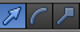
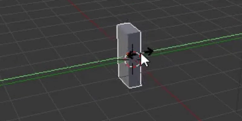

## Creează un trunchi de copac

Pentru a crea un trunchi de copac, trebuie să redimensionăm cubul. Pentru a realiza acest lucru, vom folosi săgețile colorate cu albastru, verde și roșu.

Cu ajutorul acestor săgeți, poți deplasa cubul de-a lungul axei x, axei y sau axei z. Fiecare săgeată are un vârf îndreptat în direcția axei sale /

De asemenea, poți schimba ceea ce fac aceste săgeți. Pentru a realiza acest lucru, poți utiliza meniul din partea de jos a vizualizării 3D.

În loc de săgeți, putem avea cuburi la capetele lor prin selectarea acestei opțiuni din meniu. Capetele sageților îți permit să strângi și să întinzi cubul aducându-l orice formă dorești!

+ Selectează din meniu capetele sub formă de cub. În acest moment, săgețile tale ar trebui să aibă la capete cuburi.

+ Strânge și întinde cubul tău astfel încât acesta să arate ca un trunchi de copac. De exemplu:

+ Rotește vizualizarea pentru a vedea dacă trunchiul copacului arată bine și, dacă nu, micșorează-l și întinde-l până ajungi la forma dorită.