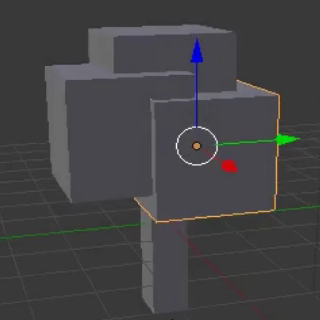

## Adăugă ramuri și frunze

Hai să adăugăm niște ramuri și frunze. Pentru asta, va trebui să adăugăm mai multe cuburi ca să umplem ramurile de frunze.

+ În primul rând, vei observa că există un cerc mic în cub.

Dacă vei da click stânga undeva în vizualizarea 3D, cercul va fi plasat în acea locație. Acesta este cursorul 3D. Când adaugi un obiect, obiectul va fi plasat în locația cursorului 3D.

+ Asigură-te că ai cursorul undeva în interiorul vizualizării 3D și dă click stânga — ar putea fi mai util mai aproape de trunchiul arborelui. Observă că vei avea cursorul 3D în poziția în care ai dat click.

+ Adăugă un cub selectând **Create** > **Cube** din **Toolbox** din meniul de pe partea stângă.

+ Dă click în altă parte în vizualizarea 3D (preferabil tot lângă trunchiul copacului) și adăugă un alt cub. De exemplu:

+ Vei da iarăși click, în alt loc în vizualizarea 3D și vei adăuga astfel un cub nou.

Acum există trei cuburi în vizualizarea 3D. Poți utiliza din nou săgețile pentru a deplasa cuburile corespunzător în jurul trunchiului pentru a-l face să pară un copac.

+ Din meniul de sub vizualizarea 3D, selectează capetele săgeților pentru a putea muta cuburile.

+ Deplasează cuburile deasupra trunchiului copacului într-un aranjament asemănător coroanei unui copac. De exemplu:

+ Rotește vizualizarea 3D utilizând butonul mijlociu al mouse-ului și verifică dacă arborele arată bine din toate unghiurile, ajustând acolo unde consideri necesar. De exemplu:

În imaginea de mai sus, cuburile nu sunt poziționate corespunzător pe trunchiul copacului.